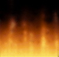



## Realtime Fire

### Description

This program simulates fire. I have seen other articles that simulate fire, but this one is extremely fast (76 FPS on my 366) and it uses some neat API calls that most programmers probably have never seen before. There is a small flaw in the program that I have been unable to fix. (look in the readme for a description). Please vote and leave comments, I really want to know what you think of my program. I have commented it heavily so even a beginner should be able to understand what each line does.
 
### More Info
 
Cool Fire effect

             |
---                |---
**Submitted On**   |2000-11-26 23:06:14
**By**             |[Odin](https://github.com/Planet-Source-Code/PSCIndex/blob/master/ByAuthor/odin.md)
**Level**          |Advanced
**User Rating**    |4.8 (24 globes from 5 users)
**Compatibility**  |VB 5\.0, VB 6\.0
**Category**       |[Graphics](https://github.com/Planet-Source-Code/PSCIndex/blob/master/ByCategory/graphics__1-46.md)
**World**          |[Visual Basic](https://github.com/Planet-Source-Code/PSCIndex/blob/master/ByWorld/visual-basic.md)
**Archive File**   |[CODE\_UPLOAD1210011262000\.zip](https://github.com/Planet-Source-Code/odin-realtime-fire__1-13136/archive/master.zip)

### API Declarations

a couple (refer to code)

